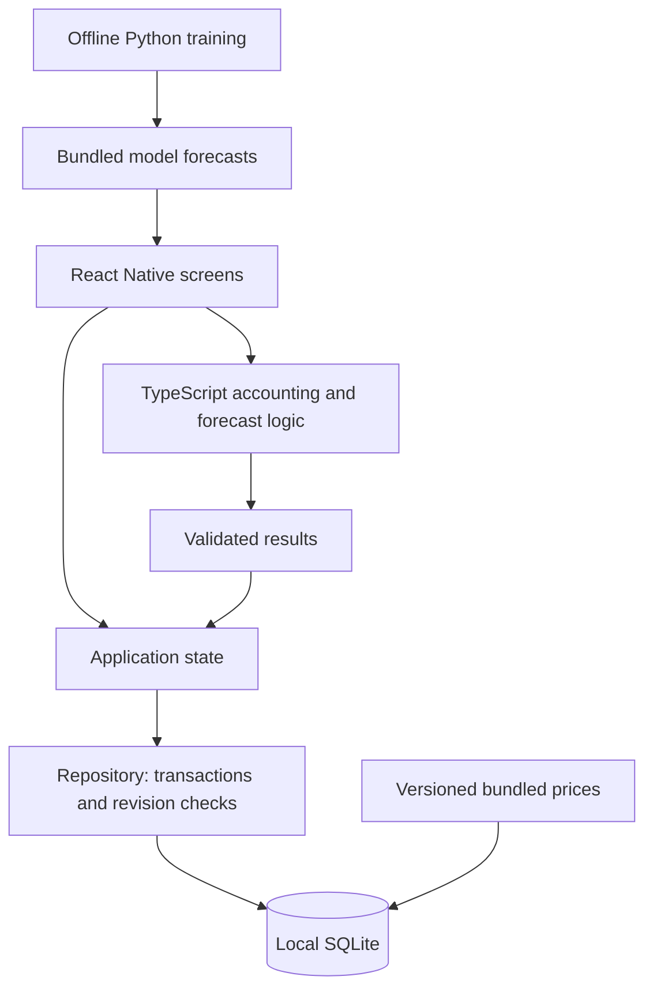

# TrySE — Stock Learning

**Learn a concept. Practice a trade. Explain the result.**

TrySE is a Traditional Chinese and English stock-learning app built with React Native, Expo, and TypeScript for iOS and Android. It brings beginner lessons, quizzes, a trading simulator, and a forecast challenge into one learning flow.

This is a rebuild of a 2019 Android capstone project. The original combined nine lessons, 50 SQLite quiz questions, and a TSMC/Innolux simulator. This version preserves the original repository, selectively adapts its educational content, and replaces its error-prone trading logic with a tested accounting engine.

> **Current status:** a working, local-first prototype with 20 stocks and synthetic prices. Browser flows have been checked and iOS/Android bundles export successfully. Native device testing and licensed historical market data are still pending.

## The project in 30 seconds

> “I’m rebuilding my Android stock-learning capstone as a bilingual, cross-platform app. The main engineering challenge is making the simulator’s accounting reliable: money uses integer units, partial sales have explicit rounding rules, and trades and portfolio state are saved in one SQLite transaction. I also added a forecast replay challenge that compares the learner with a simple model and a no-change baseline. The current prototype uses synthetic data so the learning flow and accounting can be tested before integrating licensed market data.”

## What you can demonstrate

| Feature           | Learner experience                                                                                                                     |
| ----------------- | -------------------------------------------------------------------------------------------------------------------------------------- |
| Guided learning   | Nine bilingual lessons with examples, hints, knowledge checks, and saved answer history.                                               |
| Trading practice  | Buy and sell whole shares, advance a replay, and inspect cash, holdings, cost basis, and realized/unrealized gains.                    |
| Two markets       | Ten Taiwan stocks and ten US stocks, with independent TWD and USD practice wallets.                                                    |
| Forecast lab      | Lock a one- or five-session prediction, reveal the hidden outcome, and compare errors against a baseline and a ridge-regression model. |
| Further reading   | Twelve external resources with search, language filters, bookmarks, and read status.                                                   |
| Local persistence | Resume portfolios, lessons, quiz attempts, and predictions after reopening the app. No account required.                               |

Language changes preserve progress and do not change the selected market or currency. Chinese uses a blue/gray interface and red-for-gain/green-for-loss amounts. English retains the green theme and opposite profit/loss colors. Signed amounts remain visible; chart lines use the interface accent color.

### A three-minute demo

1. **Learn:** open a lesson, submit an incorrect answer, read the explanation, then correct it. Show that both attempts are retained.
2. **Practice:** buy shares, advance a session, and sell part of the position. Explain how cash, remaining cost basis, and realized profit differ.
3. **Resume:** reload the app to show persistence, then switch languages to show the same learning progress and portfolio.
4. **Experiment:** lock a forecast and reveal the outcome. Compare the learner, the unchanged-price baseline, and the model without claiming the model can reliably predict markets.

## Engineering decisions worth discussing

### Accounting is independent of the interface

The [TypeScript engine](src/domain/engine.ts) validates orders and returns new portfolio state. Screens collect input and display results; formatted text is never used as an accounting source.

Money is stored as integer hundredths of a currency unit. Partial sales release weighted-average cost with an explicit rounding rule, and a final sale releases all remaining cost. Tests cover purchases, partial/full sales, invalid orders, duplicate submissions, market isolation, and reconciliation.

### A save must preserve the whole transaction

The [SQLite repository](src/storage/repository.ts) commits the application snapshot and trade journal in one transaction. A failed save rolls back both. Revision checks reject stale writers, and loading/saving verifies that active portfolios match their journal entries.

Existing trades and quiz attempts cannot be rewritten through repository saves. Locked forecasts can be revealed but cannot have their predictions changed. Restarting a replay creates a new session and retains its old journal.

**Tradeoff:** learning and session state currently use a versioned JSON snapshot alongside normalized market-data tables and a queryable trade journal. This keeps the offline prototype small; accounts, larger histories, and cross-device sync will need further schema work.

### Forecasts must respect what was known at the time

The [Python pipeline](scripts/train_forecasts.py) trains a small scikit-learn ridge-regression model using trailing returns. Each forecast cutoff uses only training inputs and labels available by that cutoff. A test changes future prices and checks that the earlier prediction stays unchanged.

The app bundles **520 precomputed forecasts** and compares them with a no-change baseline. This avoids a model service in the first build and makes the experiment reproducible. Synthetic-data results demonstrate the workflow, not forecasting performance on real markets.

### Legacy content is reused selectively

The original repository remains unchanged. Its 50 quiz questions are preserved in a [review archive](data/legacy/questions.zh-TW.json), with source references and a checksum. The app currently uses nine curated bilingual knowledge checks; the full legacy question bank is not presented as reviewed or published content.

## Architecture and stack



| Layer         | Technology and purpose                                                                |
| ------------- | ------------------------------------------------------------------------------------- |
| App           | React Native + Expo + TypeScript; shared iOS/Android code and a browser preview.      |
| Storage       | `expo-sqlite`; local prices, application state, and trade journal.                    |
| Domain        | Pure TypeScript functions for orders, accounting, valuation, and forecast evaluation. |
| UI checks     | Jest, `jest-expo`, and React Native Testing Library.                                  |
| Data tooling  | Python CSV validation and SQLite staging imports.                                     |
| ML experiment | Python + scikit-learn; offline training and precomputed predictions.                  |

See [development notes](docs/DEVELOPMENT.md) for the source map, persistence details, and CSV import contract.

## Data and simulation boundaries

**Where do prices come from?** The running app uses generated fixtures: **15,660 fictional daily OHLCV records**, labeled 2023–2025, across 20 stock identifiers. It does not currently call a price API or crawl websites. Those dates follow a fictional weekday calendar, not actual exchange sessions.

The catalog includes Taiwan stocks such as TSMC, MediaTek, and Hon Hai, and US stocks such as Apple, Microsoft, and NVIDIA. Company identifiers are real; their bundled prices are synthetic. The [full catalog](src/data/instruments.json) contains all 20 instruments.

A CSV importer validates permitted external data and stages it with source metadata and a dataset version. **Staged imports are not yet available for app replay.** Provider selection, usage rights, real trading calendars, and corporate-action coverage must be resolved before activation.

### Accounting rules

- Starting cash: **TWD 1,000,000** and **USD 100,000**, in separate wallets.
- Whole shares only; immediate execution at the displayed synthetic close.
- Zero fees/taxes; no leverage, short selling, or currency conversion.
- Weighted-average cost; partial-sale cost rounds half up to a minor unit.
- Price changes affect market value, while cash changes through recorded transactions.
- Trading exercises use 20 or 60 fictional sessions starting at `2024-01-02`; forecast challenges use separate 2025 cutoffs.
- Split and cash-dividend primitives are tested, but real entitlement/payment timing and fractional-share policies remain incomplete. The bundled scenarios contain no corporate actions.

## Run locally

Requires **Node.js 22.13+** and npm.

```sh
npm ci
npm run web          # Local browser preview
```

For native development:

```sh
npm start            # Expo development server
npm run ios          # Requires Xcode and an iOS simulator
npm run android      # Requires Android SDK and an emulator/device
```

Use an Expo Go version compatible with the project's SDK 57, or a compatible development build. The web preview uses SQLite too; `metro.config.js` provides its required cross-origin isolation headers. A hosted web export would need equivalent headers.

## Verification

```sh
npm run check          # TypeScript, Jest, SQLite persistence, CSV importer tests
npm run format:check
npm run export:native  # iOS/Android JS and Hermes bundles, not signed apps
```

To run the separate forecast checks:

```sh
python3 -m venv .venv
.venv/bin/python -m pip install -r scripts/requirements.txt
npm run test:models
```

Validation covers accounting, transaction rollback, saved-history protection, lesson interactions, CSV validation, and future-data isolation. Browser checks include trades, reload persistence, bilingual themes, bookmarks, and forecast reveal. **Bundle export is verified; native simulator/device execution is not yet verified.**

## Next steps

| Phase                    | Scope                                                                                                                                                 |
| ------------------------ | ----------------------------------------------------------------------------------------------------------------------------------------------------- |
| Finish the testing phase | Verify native devices, integrate licensed daily history for the 20 stocks, validate calendars/corporate actions, and review more educational content. |
| Expand paper trading     | Add Taiwan 50/0050, S&P 500, and QQQ collections; introduce PostgreSQL/Supabase, versioned downloads, and scheduled market-data imports.              |
| Improve realism          | Model fees, taxes, settlement, order states, and broader corporate actions. Account synchronization needs its own conflict policy.                    |

The [detailed roadmap](docs/ROADMAP.md) preserves the proposed market universe, data-source candidates, database expansion, and completion criteria. Cloud services and automatic price updates are planned, not implemented. Real-money brokerage integration would be a separate milestone.
