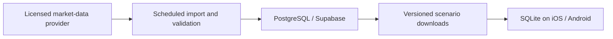

# TrySE Stock Learning

A bilingual stock-learning app for iOS and Android that combines guided lessons, quizzes, simulated trading, and an experimental AI forecast lab.

This project rebuilds a 2019 Android capstone project. The original contains nine lessons, 50 SQLite quiz questions, and a TSMC/Innolux simulator. We will selectively reuse reviewed educational content and rebuild the trading logic with tests.

**Status: the first runnable testing build is implemented.** It uses clearly labeled **synthetic prices**, not downloaded historical market prices. Licensed market-data integration and native device verification remain pending.

## Run the app

Requires Node.js 22.13+ and npm. Install dependencies, then start Expo:

```sh
npm ci
npm start
```

Open with an Expo Go version supporting SDK 57, or use a compatible development build. `npm run ios` requires full Xcode and an iOS simulator; `npm run android` requires an Android SDK/emulator or connected device.

For a local browser preview:

```sh
npm run web
```

The preview also uses SQLite. `metro.config.js` supplies the cross-origin isolation headers required by its web worker. If hosting a web export later, the host must supply equivalent headers. No hosting or cloud services are configured in this build.

### Available now

- Responsive overview, bilingual tutor, trading practice, forecast lab, and resource library.
- Nine bilingual lessons, nine reviewed knowledge checks, hints, worked examples, and related external resources.
- Twelve resource cards with language/search filters, bookmarks, and explicit read status.
- The agreed 20-stock catalog, separate TWD/USD wallets, whole-share buy/sell, 20/60-session resets, holdings, gains, and ledger history.
- SQLite persistence for the dataset, portfolios, trades, learning progress, language, bookmarks, and predictions.
- Deterministic 2023–2025 **fictional weekday data**, 15,660 price records in total. These are not actual exchange calendars or actual company prices.
- 520 precomputed ridge-regression forecasts, generated using only data known at each cutoff. Predictions must be locked before their outcomes can be revealed.
- A validated CSV-to-SQLite staging importer with source metadata and immutable dataset versions. Imported historical data is not yet activated in the mobile app.

The original 50 questions are preserved in `data/legacy/questions.zh-TW.json`, with a source checksum and `needs-review` status. They are not loaded into the learner interface. Selected concepts have been rewritten and translated into the reviewed lessons; two active questions retain their original question IDs. This is not a claim that the full legacy bank has been reviewed.

### Verification

```sh
npm run check          # TypeScript, Jest, real SQLite persistence, CSV importer tests
npm run format:check
npm run export:native  # Produce iOS and Android JS/Hermes bundles; not signed apps
```

To regenerate or test the Python model:

```sh
python3 -m venv .venv
.venv/bin/python -m pip install -r scripts/requirements.txt
npm run data:forecasts
npm run test:models
```

`npm run data:generate` regenerates the deterministic synthetic price fixture. Regenerate forecasts afterward if the fixture changes, and introduce a new dataset ID whenever its contents change.

Validated during the initial build: TypeScript checks, accounting and transaction-rollback tests, lesson interaction tests, CSV import tests, model future-data isolation, browser buy/sell and reload persistence, language switching, resource bookmarks, and forecast reveal. iOS and Android bundles export successfully. **Native simulator/device execution has not been verified** because full Xcode and Android tooling were unavailable on the development machine.

### Current accounting rules

- Starting balances: **TWD 1,000,000** and **USD 100,000**.
- All prices and money are integer hundredths of the quoted currency; shares are positive whole numbers.
- Weighted-average book cost; partial-sale cost rounds half up to a minor unit. A final sale releases all remaining cost.
- Immediate execution at the displayed synthetic close, zero fees/taxes, no leverage, no FX conversion.
- Market value changes on advancing a session; cash changes only through recorded transactions.
- The engine tests integer-result splits and simplified cash dividends. Fractional-share split outcomes are rejected. Real ex-date entitlement, pay-date timing, and cash-in-lieu policies are pending; the bundled demo contains no corporate actions.
- Trading replay starts on the fictional session labeled `2024-01-02`. The forecast lab uses separate 2025 cutoffs.
- Each save commits its ledger and state together; stale writers and duplicate order IDs are rejected. Restarting a scenario creates a new session ID and retains the prior SQL journal.

See [development and data notes](docs/DEVELOPMENT.md) for the source layout, importer contract, and remaining integration work.

## Roadmap

The roadmap has two phases:

- **Testing phase:** a small, offline-capable learning app with 20 stocks and a fixed historical dataset.
- **Future phase:** a larger paper-trading platform with broader market coverage, automatic data updates, and more realistic trading behavior. Real-money brokerage integration would be a separate project milestone.

## Original project and reuse policy

Original repository: `/Users/willsu/Documents/GitHub/NCU_IM_CapstoneProject`

- Preserve the original repository unchanged.
- Copy only selected lessons, questions, and explanations into this rebuild after reviewing their accuracy and suitability.
- Retain original content IDs or source references so changes and translations can be traced.
- Review content ownership and attribution before publishing reused materials.
- Replace the original Android screens and trading/accounting implementation.
- Do not depend on the original Firestore service for the new simulator's dataset.

## Phase 1: Testing phase — what we will build first

### Goal

A learner can understand a basic investing concept, check their knowledge, practice it in a historical trading scenario, and explain the resulting portfolio changes.

The first phase validates the learning experience, accounting engine, persistence, and data-import workflow before expanding market coverage.

### Initial scope

| Area              | Planned scope                                               |
| ----------------- | ----------------------------------------------------------- |
| Platforms         | iOS and Android                                             |
| Languages         | Traditional Chinese (`zh-TW`) and English (`en`)            |
| Instruments       | 10 Taiwan stocks and 10 US stocks                           |
| Historical period | 2023–2025, subject to per-instrument data validation        |
| Price frequency   | Daily open, high, low, close, and volume where available    |
| Portfolios        | Separate TWD and USD practice portfolios                    |
| Replay scenarios  | 20- and 60-trading-session exercises                        |
| Storage           | Local SQLite; no account required                           |
| Updates           | Manually run, repeatable dataset import; no live price feed |

### Taiwan test universe

These are curated, widely followed companies with some industry variety. The list is not a ranked measure of popularity or trading volume. Innolux is excluded from the first test.

| Code | Traditional Chinese name | English name           | Industry                            |
| ---- | ------------------------ | ---------------------- | ----------------------------------- |
| 2330 | 台積電                   | TSMC                   | Semiconductor manufacturing         |
| 2454 | 聯發科                   | MediaTek               | Chip design                         |
| 2317 | 鴻海                     | Hon Hai / Foxconn      | Electronics manufacturing           |
| 2308 | 台達電                   | Delta Electronics      | Power and automation                |
| 2382 | 廣達                     | Quanta Computer        | Computers and servers               |
| 3711 | 日月光投控               | ASE Technology Holding | Semiconductor packaging and testing |
| 2303 | 聯電                     | UMC                    | Semiconductor manufacturing         |
| 2881 | 富邦金                   | Fubon Financial        | Financial services                  |
| 2891 | 中信金                   | CTBC Financial         | Financial services                  |
| 2412 | 中華電                   | Chunghwa Telecom       | Telecommunications                  |

The approved **10 US test stocks** are Apple (`AAPL`), Microsoft (`MSFT`), NVIDIA (`NVDA`), Amazon (`AMZN`), Alphabet Class A (`GOOGL`), Meta (`META`), Tesla (`TSLA`), JPMorgan Chase (`JPM`), Coca-Cola (`KO`), and Johnson & Johnson (`JNJ`). Their inclusion is a curated test list, not a historical constituent-membership claim.

### Bilingual learning and beginner tutor

- Detect the device language and allow an explicit language switch.
- Translate navigation, lessons, questions, explanations, hints, and simulator messages.
- Keep progress tied to stable content IDs, independent of language.
- Keep language separate from market and currency: switching to English does not convert TWD into USD.
- Review the original nine lessons and 50 questions, retaining suitable material and adding content for US markets and forecast literacy.
- Provide wrong-answer review and links back to the relevant lesson.

The guided tutor will cover stock ownership, exchanges, prices, dividends, risk, diversification, trading basics, Taiwan/US market differences, portfolio accounting, and forecast uncertainty.

Each lesson follows:

**Explanation → worked example → knowledge check → simulator exercise → further reading**

The initial tutor uses reviewed explanations, hints, and examples. Open-ended AI conversation is outside the testing phase.

### External learning library

Start with approximately 12–20 reviewed links, including one or two relevant resources per lesson.

Initial sources:

- [TWSE 投資人知識網](https://investoredu.twse.com.tw/Pages/TWSE.aspx)
- [TWSE 宅在家學習網](https://shl.twse.com.tw/)
- [SEC Investor.gov](https://www.investor.gov/introduction-investing)
- [FINRA Investing Basics](https://www.finra.org/investors/investing/investing-basics)

Resource cards show the publisher, topic, source language, format, difficulty, a bilingual description, and last-reviewed date. Learners can filter, bookmark, and mark resources as read. Opening a link alone does not count as completing a lesson. External pages retain their original language.

### Historical trading simulator

- Buy and sell whole shares, advance one trading session, inspect the portfolio, and restart a scenario.
- Display cash, holdings, cost basis, market value, realized/unrealized gains, and transaction history.
- Save and resume after the app closes.
- Hide prices after the scenario's current date.
- Follow each market's trading calendar; do not fabricate prices for holidays or missing sessions.
- Use simplified immediate execution at the displayed historical closing price, explicitly presented as a learning rule rather than a realistic execution guarantee.
- Start with disclosed zero trading fees and taxes, without leverage, short selling, or currency conversion.
- Apply splits and dividends correctly when they occur in an included scenario. Scenario eligibility depends on having the required corporate-action data.

The current build's balances and cost-basis/rounding rules are specified above. Real-data scenarios must also define corporate-action eligibility before activation.

### Accounting engine and tests

The accounting engine will be a standalone TypeScript module. Screens submit orders; the engine validates them and returns accounting changes. Displayed text is never the source of portfolio state.

- Represent money with scaled integers and explicit currency/rounding rules.
- Record executed trades and cash movements so balances can be reconciled from history.
- Persist each trade and its related cash/position changes atomically.
- Reject invalid quantities, insufficient cash, and overselling without changing state.
- Use unique submission IDs to prevent duplicate execution.
- Keep instruments, currencies, and simulation sessions independent.
- Pin each replay session to a dataset version.

Required tests include:

- Purchases, full sales, partial sales, and cost-basis calculations.
- Invalid orders leaving cash and holdings unchanged.
- Instrument and currency isolation.
- Price changes affecting market value without changing cash.
- Splits and dividends in supported scenarios.
- Duplicate submissions, transaction rollback, and save/resume.
- A worked multi-trade scenario with independently calculated expected balances.
- Historical-date boundaries and missing-session handling.

Small synthetic price sequences will support deterministic accounting tests. Licensed real historical data will support learner replay scenarios.

### AI forecast replay lab

The first lab is **“You vs. the model”**, using hidden historical outcomes.

1. Select a stock and historical cutoff.
2. View only data available through that cutoff.
3. Predict the price one or five trading sessions ahead.
4. Compare the learner's prediction with a “price stays unchanged” baseline and one small ML model.
5. Reveal the actual outcome and compare prediction errors.

Use Python and scikit-learn for offline experiments, then import precomputed forecasts into the app. Store the dataset version, model version, training cutoff, forecast horizon, and predicted values.

Training, preprocessing, model selection, and evaluation must respect chronological boundaries. The model must not use future prices or future-derived adjustments as input. Preserve predictions separately from actual prices and test for future-data leakage.

The three-year dataset supports an initial experiment; it is not enough to establish broad forecasting reliability. Selecting present-day surviving companies also introduces selection bias, which must be acknowledged when presenting results.

### Proposed technology

| Component                     | Choice                                          |
| ----------------------------- | ----------------------------------------------- |
| Mobile app                    | React Native + Expo + TypeScript                |
| Local database                | SQLite through `expo-sqlite`                    |
| Accounting logic              | Standalone TypeScript module                    |
| Unit/component tests          | Jest, `jest-expo`, React Native Testing Library |
| Forecast experiments          | Python + scikit-learn                           |
| Initial content/data delivery | Versioned bundled dataset                       |

SQLite remains the mobile database if a shared backend is introduced later. Database migrations and storage access should be separated from screen code; PostgreSQL integration will still require deliberate schema mapping and synchronization work.

### Initial database design

| Data group                  | Proposed tables                                                                |
| --------------------------- | ------------------------------------------------------------------------------ |
| Instruments and collections | `instruments`, `collection_memberships`                                        |
| Market data                 | `datasets`, `daily_prices`, `corporate_actions`, `trading_sessions`            |
| Simulation                  | `simulation_sessions`, `trades`, `cash_ledger`, `positions`                    |
| Learning                    | `lessons`, `questions`, translation tables, `lesson_progress`, `quiz_attempts` |
| External resources          | `resources`, `lesson_resources`, `bookmarks`                                   |
| Forecasts                   | `forecast_runs`, `forecast_points`, `forecast_evaluations`                     |

Use stable instrument IDs rather than ticker strings alone. Price records are unique by dataset, instrument, and trading date. Holdings and balances must reconcile with recorded transactions; cached position summaries are not an independent accounting authority.

For sizing, 20 stocks × 3 years × approximately 250 sessions is about **15,000 daily price records**. This is a planning estimate, not an imported or measured dataset.

### Market-data sources and first import

| Data                 | Proposed source                                        | Status                                        |
| -------------------- | ------------------------------------------------------ | --------------------------------------------- |
| Taiwan price history | TWSE historical datasets or an authorized vendor       | Acquisition route and usage rights to confirm |
| US price history     | Twelve Data; Alpha Vantage as an alternative           | Coverage, cost, and usage rights to confirm   |
| 0050 holdings        | Yuanta published holdings                              | Record the membership snapshot date           |
| Splits/dividends     | Exchange or licensed provider corporate-action records | Validate coverage for selected stocks         |

References:

- [TWSE historical daily trading data](https://www.twse.com.tw/en/trading/historical/stock-day.html)
- [TWSE Data E-Shop](https://eshop.twse.com.tw/en/)
- [TWSE usage terms](https://www.twse.com.tw/zh/terms/use.html)
- [Yuanta 0050 holdings](https://www.yuantaetfs.com/product/detail/0050/ratio)
- [Twelve Data stock coverage](https://twelvedata.com/stocks)
- [Twelve Data usage terms](https://support.twelvedata.com/en/articles/5332349-commercial-and-personal-usage)
- [Alpha Vantage documentation](https://www.alphavantage.co/documentation/)

Publicly viewable data is not automatically authorized for automated downloading or app redistribution. Confirm permitted acquisition, storage, forecast use, and learner distribution before bundling a dataset. No dataset or provider license has been acquired yet.

The first importer will run manually: acquire permitted data, normalize dates and units, validate records and corporate actions, then produce a versioned SQLite dataset. Repeating an import must not create duplicates. Source corrections produce a new dataset version instead of silently changing an active replay.

### Testing-phase completion criteria

- A learner can complete a bilingual lesson and quiz, follow an external resource, and resume progress after restarting.
- Both market portfolios support a complete replay scenario with tested, reconcilable accounting.
- Dataset imports are repeatable, validated, and traceable to their sources.
- The forecast challenge compares learner, baseline, model, and actual results without future-data leakage.
- Critical user flows are verified on both iOS and Android.
- The original repository remains unchanged.

## Phase 2: Future phase — potential expansion

These are possible extensions after the testing phase, not commitments to implement them all at once.

### Broader market universe

- All Taiwan 50 constituent stocks represented by the 0050 collection.
- S&P 500 constituent securities.
- QQQ equity holdings, representing its Nasdaq-100 exposure.
- Deduplicate instruments shared by US collections while preserving separate share classes and listings.
- Potentially add ETFs themselves as tradable instruments.
- Extend daily history toward **2015–2025**, then append newer completed sessions where data rights and coverage allow.

Roughly 650 instruments is an initial capacity-planning allowance, not a verified constituent count. At 11 years and approximately 250 sessions per year, that is about **1.8 million daily price records** before adding former members.

Start with clearly dated membership snapshots. A later, more faithful historical mode would use membership effective dates and include former members and delisted stocks. Current membership must not be presented as the actual historical universe.

### Shared backend and automatic updates

Use **PostgreSQL hosted through Supabase** for the shared market catalog, historical datasets, learning content, and published forecasts. Keep SQLite for downloaded scenarios and local learner state.



The update process would:

1. Check for completed daily data after each market's session and the provider's publication delay.
2. Fetch missing dates and recheck recent records for corrections.
3. Validate prices and corporate actions; retry failures without inventing data.
4. Publish a new dataset version with source and coverage metadata.
5. Let the app download updates for selected instruments when opened or refreshed.

Display the data coverage date. Existing scenarios retain their pinned version; new scenarios can use the updated dataset. Provider credentials remain on the server. Larger imports should be divided into retryable batches.

Automatic price downloads and cross-device learner synchronization are separate features. Account sync would need authentication, access controls, and explicit conflict handling.

### More realistic paper trading

- Market and limit orders, cancellation, and explicit order states.
- Fees, taxes, settlement rules, and market-specific trading constraints.
- Multi-currency portfolios and explicit FX transactions.
- More complete corporate-action and delisting handling.
- Benchmarks, portfolio analytics, watchlists, and longer scenarios.
- Delayed or live quotes if provider agreements and costs support them.
- Intraday execution models only when suitable data is available; daily bars cannot establish the exact order of intraday price movements or fills.

### Expanded education and AI experiments

- Additional bilingual lessons and market-specific learning paths.
- Reviewed AI tutoring grounded in approved educational sources.
- More forecasting models, uncertainty estimates, and chronological evaluation periods.
- Live forecast experiments whose predictions are saved before outcomes become known.
- Scheduled model evaluation and retraining, with model and dataset version tracking.

### Optional real-money trading milestone

The current product is an educational simulator. Connecting to actual brokerage accounts would require a separate scope covering broker APIs and sandbox testing, identity/account workflows, order reconciliation, security, operational monitoring, and applicable broker/exchange requirements.

The simulated accounting engine alone is not sufficient to operate a real-money trading service.

## Remaining work and decisions

- Confirm data providers, budget, and permitted data uses.
- Validate 2023–2025 price and corporate-action coverage for all 20 stocks.
- Connect reviewed, licensed datasets to the app's scenario catalog, with actual exchange calendars and corporate-action policies.
- Review and translate more of the original quiz bank; add per-attempt history and broader lesson coverage.
- Evaluate the forecast model on licensed real data with documented chronological splits and selection-bias limits.
- Verify on physical iOS/Android devices or native simulators.
- Add accounts, cloud delivery, and automatic data imports only as the future phase requires.

The first build is an offline educational prototype. No price API, web crawler, brokerage connection, or live trading service is active.
